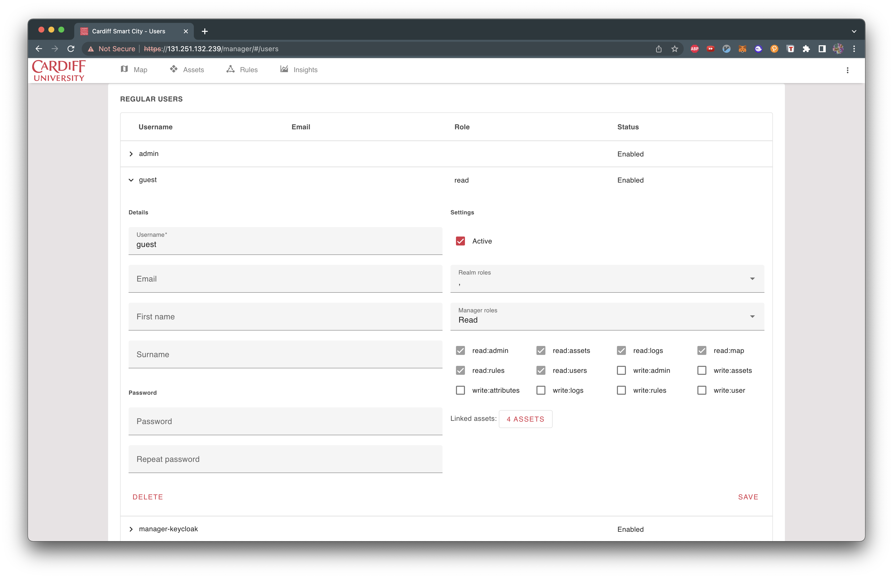
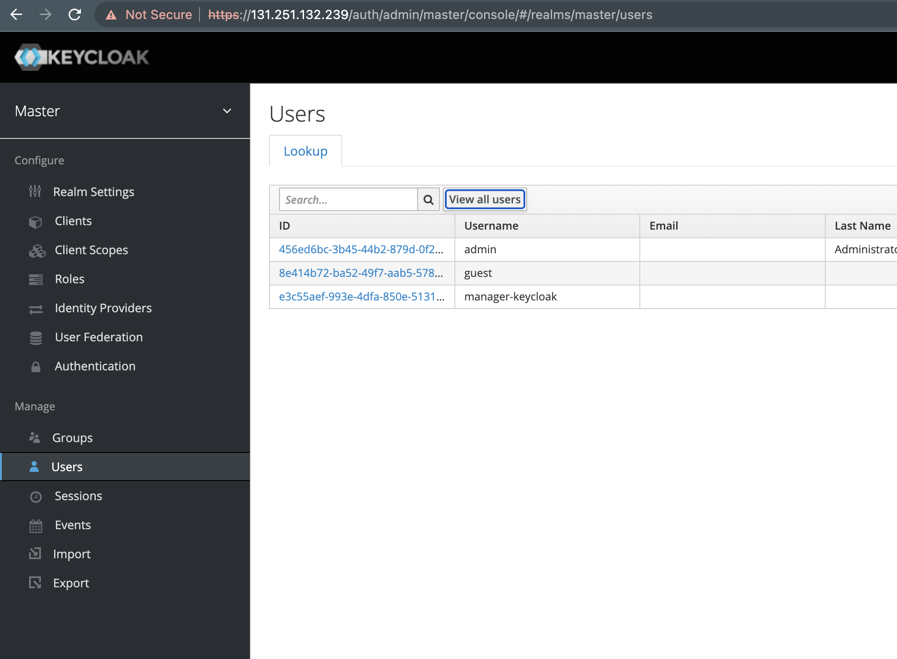

# Cardiff Smart City - Kieran Williams

## Open Remote Features

### Map containing assets

Assets can contain custom properties that can contain both static and dynamic data. Data can be
retrieved via an agent asset such as HTTP, MQTT, etc...

### Rule engine

<table>
<tr>
<td>

Ability to configure logic to the running platform.

Example here is that a people counter can calculate
the number people in the building from the number of
people that have gone in and the number that have
gone out.

This could be extended to work with another asset
that could for example turn on/off the heating/ AC to
a building

The Rule Engine can be configured with block flows
as shown in the example, when then structures or
groovy code that describes the rules

</td>
&nbsp;
<td>

</td>
</tr>
</table>

### Polling data from a data source

Using a http agent a data source can be configured. The example uses a custom server service
running alongside the open remote container. This custom server is a Node JS Express server that
is set up to retrieve air quality data using web scraping to get a download link, download the csv
data, parse it to json and then host it at a HTTP endpoint

### Recording data points providing insights

### Export data from assets

### Provision users with differing privileges

## Setup of Cardiff Smart City

### System install requirements:

- nodejs
- yarn
- Java 17 exactly installed
- docker

### Custom server setup

<table>
<tr>
<td>

#### docker-compose.yml 

</td>
<td>

#### Dockerfile

</td>
</tr>
</table>

### ./Deployment folder for customising the manager

More info at: https://github.com/openremote/openremote/wiki/User-Guide%3A-Custom-deployment

The keycloak directory holds the themes which need to be changed at /auth in the address bar.

The manager directory has a config .json file for setting up the map tiles, colours, bounds etc...
and the images used to set up the customisation of the base system.

Map directory contains the map box tiles. These can be downloaded from map box

### docker-compose.yml set up

In the root of the directory there is a docker-compose.yml file that sets up the system

### Building and running the system

In the root directory run:

    $ sudo chmod +x gradlew

    $ ./gradlew clean installdist

    $ docker compose up —build -d

This should build the system, pull the containers and run them

### Keycloak authentication theme set up

Navigate to /auth and click administration console. Then go to the themes tab and change to
customopenremote and click save.

### Setting up guest privileges to remove the ability of changing password.

Navigate on the side panel to Users and select guest after creating a guest in the open remote
system, select view all users. Then select the guest user id. From the tabs, select role mappings
and provide the roles shown below.

## Resources

- [Website](https://openremote.io/)
- [Forum](https://forum.openremote.io/)
- [Github](https://github.com/openremote/openremote)

